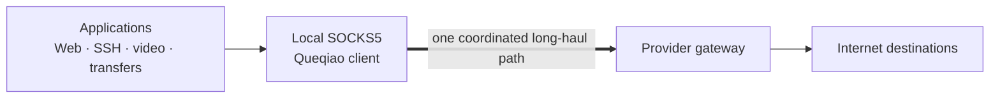

<p align="center">
  
</p>

<h1 align="center">Queqiao</h1>

<p align="center">
  <strong>Make difficult long-haul links feel local.</strong><br>
  An open-source, self-hosted transport for TCP and UDP across a long link you control both ends of.
</p>

<p align="center">
  <a href="docs/DEPLOYING.md">Deploy</a> ·
  <a href="#how-it-works">How it works</a> ·
  <a href="docs/STATUS.md">Project status</a> ·
  <a href="CONTRIBUTING.md">Contribute</a>
</p>

During my internship at Microsoft Research Asia in 2013,
I used Microsoft's dedicated link from China and saw,
for the first time, how fast access to Google and YouTube could be.

Later, I built a detour gateway in Hong Kong to improve the China-US route when I'm back home.
It worked, but it added infrastructure, doubled the network bandwidth cost, and increased
latency. Is it possible to directly connect China to US while
enjoying the same latency and bandwidth with dedicated links?

Although I did networking research for 10 years, I did not have the time to build it.
It is finally possible with help from Kimi K3, Claude Opus 5 and GPT-5.6 Sol.
Today, Queqiao is a ready-to-use, self-hosted protocol for supported
client-to-gateway deployments. It carries TCP and UDP through a local proxy over
an authenticated transport, and keeps evolving as we measure more paths,
improve the transport, and learn from users.

### Not only client to gateway, but also inter-datacenter

The same problem turned up between two datacenter servers. This has been our own
pain point since 2023: the models run in the US and the clients are everywhere.
ASR sends a few hundred kilobytes of audio up and gets a sentence back.
TTS sends a sentence up and gets a few hundred kilobytes back, in one
burst once the model finishes. Each is a single transfer that has to finish
before anything else happens, which is the shape a long path is worst at.

Guiyang, China to a model in Irvine, US: a 355KB audio upload takes **1185ms**, of
which the ASR model only spends about 30ms.
In theory, the path's bandwidth could carry 355KB in about 9ms.
The rest is a handshake, a transfer starting at ten segments, and a window
thrown away between requests.
Queqiao approaches the limits of this 200ms RTT link, achieving **302ms** end-to-end
on a cold connection and **237ms** once warm, which is the floor. On a sustained
transfer it reaches **310 Mbit/s**, 93% of what the path itself carries, against
3.6 to 106 Mbit/s for direct TCP.
[Why this profile exists](docs/DESIGN-DC-PROFILE.md) walks through each request; [the
runbook](docs/DEPLOYING-DC-PROFILE.md) is how to deploy it.

## Why Queqiao?

Many transports make each connection learn and react on its own. That is a
reasonable default for the general Internet, but it leaves performance on the
table when many application flows share the same difficult client-to-gateway
segment.

The path that motivated Queqiao made the problem concrete: we measured roughly
42–45% downstream packet erasure even below the path's capacity knee, followed
by clustered loss when aggregate traffic exceeded that knee. Those two regimes
need different responses. Backing off does not remove independent erasure;
ignoring overload only makes it worse. See the full
[path characterization](docs/PATH-CHARACTER-20260813.md).

Queqiao is built around a few practical observations:

- **Flows sharing one bottleneck should share one model.** Flows to different final
  destinations can still share one client-to-gateway path, so Queqiao shares
  delivery, loss, RTT, pacing, and latency-reserve state across them.
- **Not all packet loss means congestion.** A path that erases packets
  independently of the sending rate is not an overloaded one, and backing off
  does not make an erasure channel drop less. So loss is not the congestion
  signal here: the brake is a delay bound, the round trip may not exceed twice
  the path's own minimum, and the measured erasure is what sizes the code and
  compensates the window instead. A policer, which drops without queueing, is
  the case this does not yet brake -- see the [known
  limitations](docs/KNOWN-LIMITATIONS.md).
- **Choose recovery for the path.** On a long-RTT path, forward-error
  correction can recover a gap sooner than another round trip; as a flow grows,
  retransmission can become the more efficient choice.
- **Protect interactive traffic from bulk transfers.** Control and new interactive
  work must not wait behind a bulk transfer, so aggregate pacing, priority, and
  reactive isolation protect latency while the pipe is used.
- **Upstream and downstream are different.** Upstream and downstream can have very
  different capacity and loss behavior, so they are measured and controlled
  independently.

These are operating principles, not universal performance claims. Queqiao is a
good fit when the client and gateway are known, trusted endpoints and their
shared WAN segment is the dominant bottleneck. If the real bottleneck is
somewhere else, measure again before relying on the optimization.

## How it works



Queqiao presents an ordinary local SOCKS5 proxy, including UDP ASSOCIATE. The
client and provider gateway form one authenticated transport session. Inside
that session, every flow uses the same logical framing, byte-offset recovery,
acknowledgement ranges, and scheduling machinery. QUIC streams and datagrams
are used when available, with authenticated TLS/TCP fallback for restrictive
networks.

The application does not have to choose a “short-flow,” “interactive,” or
“bulk” protocol. Queqiao observes how a flow behaves and adjusts policy inside
the same architecture. HTTPS remains end-to-end; the gateway sees the
destination and traffic shape, but Queqiao does not inspect application content.

## How Queqiao compares

| System | Shared path model | Recovery strategy | Bulk median | SSH p99 under bulk load |
| --- | --- | --- | ---: | ---: |
| **Queqiao** | Shared endpoint pair | Erasure-aware FEC + retransmission | **143.1 Mbit/s** | 940 ms |
| TUIC v5 | Usually per connection | QUIC recovery | 76.8 Mbit/s | **662 ms** |
| Hysteria 2 | Usually per connection | Protocol-specific UDP/QUIC recovery | 90.2 Mbit/s | **526 ms** |

These are representative results from a six-round real-path campaign. They
show why Queqiao's shared path model is promising, while the interactive tail
shows why we do not claim a universal win. Results depend on the path and
workload; see the full [comparison and methodology](docs/COMPARISON.md).

## What you can use today

- A desktop/server client and provider gateway for TCP CONNECT and UDP
  ASSOCIATE.
- Pooled QUIC streams and datagrams, with automatic authenticated TLS/TCP
  fallback.
- Shared endpoint-pair path measurement, erasure-aware control, sliding-window
  coding, aggregate pacing, priority scheduling, and reactive bulk isolation.
- One-time invitations, provider-pinned identity, per-device mutual TLS,
  renewal, revocation, and per-user session limits.
- A starter [Clash/mihomo profile](deploy/clash-queqiao.yaml).
- One client process serving several providers, each on its own loopback SOCKS5
  listener, for Clash/mihomo routing and failover.
- Bounded JSON logs, metrics, a local visualizer, deterministic benchmarks,
  release packaging, SBOMs, and rollback procedures.

All of it ships as a prebuilt binary. Download it below, or from the
[latest release](https://github.com/bojieli/queqiao/releases/latest); there is no build step for normal use.

## Platform availability

Every release publishes reproducible, signed binaries for six native targets.
The links below are v0.5.0, the current release; the
[releases page](https://github.com/bojieli/queqiao/releases/latest) always has the newest.

| Platform | Status | Download |
| --- | --- | --- |
| macOS, Apple silicon | Desktop and gateway, ready to use | [`darwin_arm64`](https://github.com/bojieli/queqiao/releases/download/v0.5.0/queqiaod_v0.5.0_darwin_arm64_signed.zip), notarized |
| macOS, Intel | Desktop and gateway, ready to use | [`darwin_amd64`](https://github.com/bojieli/queqiao/releases/download/v0.5.0/queqiaod_v0.5.0_darwin_amd64_signed.zip), notarized |
| Linux, x86-64 | Desktop and gateway, ready to use | [`linux_amd64`](https://github.com/bojieli/queqiao/releases/download/v0.5.0/queqiaod_v0.5.0_linux_amd64.tar.gz) |
| Linux, arm64 | Desktop and gateway, ready to use | [`linux_arm64`](https://github.com/bojieli/queqiao/releases/download/v0.5.0/queqiaod_v0.5.0_linux_arm64.tar.gz) |
| Windows, x86-64 | Native target built; under testing, not production-ready | [`windows_amd64`](https://github.com/bojieli/queqiao/releases/download/v0.5.0/queqiaod_v0.5.0_windows_amd64.zip) |
| Windows, arm64 | Native target built; under testing, not production-ready | [`windows_arm64`](https://github.com/bojieli/queqiao/releases/download/v0.5.0/queqiaod_v0.5.0_windows_arm64.zip) |
| Android and iOS | Same protocol-1 core, under testing; not yet production-ready mobile apps | -- |

Check a download against its release's
[`SHA256SUMS`](https://github.com/bojieli/queqiao/releases/download/v0.5.0/SHA256SUMS)
before running it. Each archive carries its own CycloneDX SBOM and the complete
license text for every module linked into the binary.

## Quick start

Two scripts perform a whole deployment and verify the result, one per side.
Neither needs a Go toolchain: point them at the binary you downloaded above.

On the Linux gateway, as root:

```sh
sudo ./deploy/install-server.sh \
  --binary ./queqiaod \
  --name "Example Network" \
  --endpoint gateway.example.net:443 \
  --user alice \
  --tune
```

That installs the binary, service account, directories, hardened unit, and
environment file, initializes the provider, creates the first user, starts and
verifies the gateway, and only then prints one single-use invitation URI.
Deliver that URI over an authenticated private channel: it is a bearer
credential.

On the client, as the account that will use the tunnel -- not with `sudo`:

```sh
./deploy/install-client.sh --binary ./queqiaod --invite 'queqiao://enroll/...'
```

That enrolls the invitation, writes the profile and manifest, installs a
per-user service that starts at login -- a LaunchAgent on macOS, a systemd
`--user` unit on Linux -- and checks end to end that traffic reaches the
gateway. Repeat `--invite` to add providers, each on its own loopback port.

The client listens on `127.0.0.1:12080`, the port
[`deploy/clash-queqiao.yaml`](deploy/clash-queqiao.yaml) already points at.
Point an application or Clash/mihomo at that SOCKS5 endpoint.

The scripts live in this repository: clone it, or copy `deploy/` beside the
downloaded binary. From the next release they also ship inside the archives.

[Choosing and placing a gateway](docs/CHOOSING-A-GATEWAY.md) is the decision
that comes before all of this: whether a gateway will help at all, and where it
has to sit. The [deployment guide](docs/DEPLOYING.md) is the reference for
everything past this point -- what the scripts do, the hosts they do not cover, the manual
gateway and enrollment steps for a host they do not fit, firewall and socket
tuning, multiple users, source-interface selection, verification, upgrades, and
rollback. To serve several providers from one client process, see
[multi-provider](docs/DEPLOYING.md#connect-to-multiple-providers).

## Build from source

Normal use needs no build. Build to develop, or to run on a platform with no
published archive, using the Go version declared in [`go.mod`](go.mod):

```sh
go test ./...
go build -o ./queqiaod ./cmd/queqiaod
```

Both installer scripts pick up `./queqiaod` from the repository root on their
own, so the commands above work unchanged without `--binary`.
[`CONTRIBUTING.md`](CONTRIBUTING.md) lists the full development checks.

## Who is it for?

Queqiao is designed for a known difficult link between a client and a trusted
gateway. Typical deployments include:

| Use case | Optimized segment |
| --- | --- |
| Intercontinental proxy or tunnel | user or branch to a gateway on another continent |
| Remote corporate access | employee or remote site to the corporate VPN gateway |
| Weak access network | hotel, residential, mobile, or rural link to a stable relay |
| Overlay network | one long-haul leg between two overlay endpoints |
| Cross-region inference | an application in one region calling ASR, TTS, or an LLM served in another |

The repository provides this paired data plane. Discovery, global routing, and
a full mesh control plane belong to a larger overlay product built around it.

The last row is served by a second, experimental profile. A hop between two
regions one operator runs differs from an access link in where its bottleneck
is, so it gets its own profile rather than the default one: see [the datacenter
profile](docs/DEPLOYING-DC-PROFILE.md), and read its measured limits before
deploying it, because on a clean path direction a one-line client-side fix
beats it on the median request.

Both ends run this software, so a destination someone else operates -- a hosted
model API, a SaaS endpoint -- needs a gateway on a host you do control. Where
that gateway goes decides whether any of this helps: a destination already
served from an anycast edge near you can be made slower by a gateway placed on
another continent. [Choosing and placing a
gateway](docs/CHOOSING-A-GATEWAY.md) is how to settle that before spending
anything, and it covers the free client-side fixes that on a clean path reach
the same median this transport does.

## Project status

Queqiao is ready to use for the supported paired-gateway topology, from the
published binaries or from source. It is a public preview, not a production-ready claim for every
network. Protocol 1 is the only supported wire version; broader independent
field qualification, transport and security review, and mobile review remain
open. See [current status](docs/STATUS.md) for the evidence boundary and
[known limitations](docs/KNOWN-LIMITATIONS.md) for operational constraints.

Performance is path-dependent. Historical measurements are design evidence,
not a promise of throughput or latency on another ISP, carrier, hotel, campus,
or country route. A same-window baseline and a reproducible report are more
useful than a single headline number.

## Measure it with us

The same transport should serve short-lived requests, interactive sessions, and
bulk transfers. The benchmark harness measures setup and completion time,
latency and jitter under contention, useful goodput, recovery overhead, CPU,
memory, and bounded resource use. Start with [Measuring this transport](docs/BENCHMARKING.md)
and share field results using [the network-evidence guide](docs/CONTRIBUTING-NETWORK-EVIDENCE.md).

## Security and privacy

Normal traffic uses TLS 1.3 with a provider-pinned gateway identity and
provider-issued per-device mutual authentication. There is no plaintext mode,
shared tunnel password, or DNS/WebPKI identity requirement. The provider can
observe destinations and traffic shape; Queqiao is not an anonymity network.

Read the [security model](SECURITY.md), [privacy statement](PRIVACY.md), and
[protocol specification](docs/PROTOCOL.md). Report vulnerabilities privately as
described in [SECURITY.md](SECURITY.md).

## Contribute

Queqiao is an open-source project, and useful contributions are not limited to
code. You can:

- run the client on a different residential, mobile, hotel, campus, or
  intercontinental path and report what changed;
- submit a reproducible benchmark, a counterexample, or a workload regression;
- improve documentation, deployment examples, mobile clients, tooling, and
  tests; or
- propose a protocol or congestion-control change with measurements and a
  clear compatibility story.

Please remove credentials, private addresses, and user traffic before sharing.
Read the [contribution guide](CONTRIBUTING.md) and the
[network-evidence guide](docs/CONTRIBUTING-NETWORK-EVIDENCE.md) before opening a
change. Wire changes are versioned explicitly and fail closed.

## Documentation

The [documentation index](docs/README.md) links the current design,
architecture, protocol, deployment, mobile, benchmarking, release, and
qualification guides. Start with [the design](docs/DESIGN.md) if you want the
technical details behind the principles above.

Queqiao is available under the [MIT License](LICENSE).
