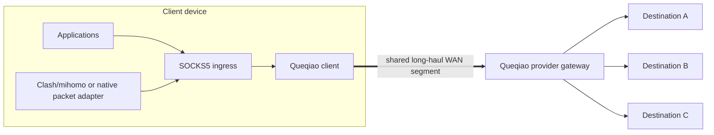
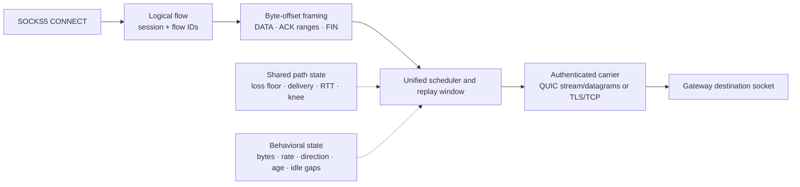

# Queqiao architecture

> [!NOTE]
> **Status:** Current implementation reference
>
> **Applies to:** Public protocol 1
> **Last reviewed:** 2026-08-20

This document describes the implementation behind the [How it works](../README.md#how-it-works)
overview. Queqiao is a paired WAN optimization system: a client accepts local SOCKS5
traffic, transports it across a known endpoint-pair segment, and a provider
gateway opens the final Internet destination. The architecture treats that
segment as a shared congestion domain even when application flows continue to
different destinations after the gateway.

## Supported topology



The final destinations are not assumed to share their post-gateway paths. The
optimization unit is the difficult link between this client/uplink and this
known gateway, where all proxied flows contend before diverging. That unit is
common to intercontinental and corporate tunnels, poor access links to a
relay, and individual legs in a wider overlay. The repository implements the
paired data plane; a full overlay control plane is outside this component.

## Components

```text
provider admin CLI ── atomic authorization state ───────────────┐
                                                               v
application → SOCKS5 → unified client data path → TLS 1.3 → gateway → destination
                         │                   │                  │
                         │                   ├─ QUIC/UDP        ├─ destination policy
                         │                   └─ TLS/TCP         ├─ UDP relay store
                         │                                      └─ optional loopback SOCKS5 upstream
                         │
                         ├─ endpoint-pair path model
                         ├─ aggregate pacing and priority
                         ├─ byte-offset recovery and FEC
                         └─ behavioral classifier (policy signal)
```

The provider creates accounts and single-use invitations. Enrollment generates
the device key on the client and returns one private profile. Enrollment,
renewal, QUIC data, and TCP data share one public endpoint but use isolated TLS
ALPN and authentication policies.

## One unified flow architecture

Every TCP CONNECT request enters the same pipeline:



There are no short-flow, interactive, and bulk protocol branches. A flow does
not choose a workload mode at OPEN. It keeps the same IDs, sequence space,
framing, acknowledgement semantics, and recovery state for its entire life.

The classifier's `NEW`, `INTERACTIVE`, and `BULK` values are cross-cutting
scheduling metadata. As the same flow evolves, that signal may affect:

- priority within the bounded lane writer;
- the aggregate pacing reserve left for control and responsive traffic;
- whether coded recovery remains worth its parity cost as the byte count grows;
- whether an existing bulk contender should reactively move its data away from
  the pooled control connection; and
- whether configured TCP-only fallback lanes should be filled.

None of those decisions changes the logical flow architecture or asks the
application to identify itself.

## Logical TCP flow

1. The client generates random non-zero session and flow IDs and sends OPEN
   with a bounded canonical destination.
2. The gateway re-authorizes the device, applies destination policy, dials the
   destination, and returns OPEN_OK or a coarse RESET.
3. Each direction is divided into DATA frames in one logical byte-offset space.
4. The receiver places out-of-order frames by offset and delivers only the
   contiguous prefix to the application.
5. Cumulative ACKs and bounded selective ranges release sender replay state.
6. CLOSE carries the direction's final offset; final ACKs complete half-close.
7. A bounded metadata-only tombstone can answer a replacement lane that missed
   the final close exchange. It retains no payload or destination socket.

The application protocol remains end-to-end. Queqiao does not terminate HTTPS
or inspect application content to classify a flow.

## Two substrates, one flow

A QUIC lane always has a reliable stream. When QUIC DATAGRAM is negotiated, the
same connection also has an unreliable datagram substrate.

| Traffic | Normal substrate | Reason |
| --- | --- | --- |
| OPEN, JOIN, ACK, CLOSE, RESET, PROBE | Reliable stream | Control must arrive and must not wait behind data it releases |
| TCP DATA while coding is useful | Sliding-window-coded QUIC datagrams | Avoid stream head-of-line delay across rate-independent erasure |
| TCP DATA after coding is no longer worthwhile | Reliable stream | Retransmission is more byte-efficient for sustained transfer |
| SOCKS UDP PACKET | QUIC datagram when available | Preserve unordered, unreliable UDP semantics |
| Any frame on TLS/TCP fallback | Reliable TLS stream | TCP provides the available carrier |

The coded substrate delivers complete Queqiao frames out of order or not at
all. Logical byte offsets and range ACKs above it handle residual loss. It does
not implement a second in-order reliable transport.

Historical code calls this connection-scoped object a `bulk` path. That name is
an internal artifact: user-visible bulk TCP data normally stops using coding
and returns to the reliable stream. Public architecture uses “coded datagram
substrate” to avoid confusing an implementation field name with a workload
branch.

## Shared path and aggregate control

The path key includes both the local uplink identity and remote gateway. Two
connections from the same uplink to the same gateway read and update one path
model; switching from Wi-Fi to cellular creates a different model instead of
carrying over stale loss and RTT state.

Each direction records its own delivery, loss floor, loss correlation, RTT,
and capacity behavior. This matters because the motivating path has a lossy
downstream and a materially different upstream.

The erasure controller separates a persistent rate-independent loss floor from
additional loss associated with overload. Pacing and the interactive reserve
apply to aggregate traffic entering the endpoint-pair bottleneck. FEC rate and
window selection consume the same directional path evidence rather than
starting an independent estimate for every flow.

After an uplink change, the client closes the old QUIC pool and may open a fresh
authenticated connection for a bounded bidirectional PROBE. The gateway echoes
at most 128 frames/128 KiB one-for-one without naming a destination. QUIC
transport acknowledgements populate sending-direction evidence before the
first user flow depends on it.

## Pooling, isolation, and carrier recovery

Pooling reuses one authenticated QUIC connection and opens one stream per
logical flow. It removes a new transport/TLS handshake from warm flow setup and
lets those flows share the endpoint-pair state.

Reactive isolation is contention control, not a second transport design. When
a growing flow and another flow contend on the pooled connection, its data can
move to a separately authenticated QUIC connection while its logical flow,
sequence space, and control/recovery state remain unchanged. A lone flow is not
isolated merely because it has transferred many bytes; doing so would pay a
fresh congestion window without protecting another flow.

Carrier recovery attaches a new lane with JOIN. Unacknowledged byte ranges and
close state are replayed on the replacement. A QUIC flow has one data connection
at a time; temporary old/new lanes exist only for bounded handoff state.

In automatic mode, QUIC is preferred and TLS/TCP is a delayed fallback. Only
differential path evidence—QUIC failing while authenticated TCP reaches the
same endpoint—marks UDP unavailable. Once a flow hands off to TCP, it does not
mix QUIC and TCP lanes.

An explicitly configured TCP fallback bundle may attach several independent
TLS/TCP lanes to one logical bulk flow. The same byte offsets and ACK ranges
preserve order, and each socket remains paced by the kernel congestion
controller. This is tail protection for UDP-blocked/high-loss fallback, not a
claim that multiple connections increase a fixed shared bottleneck.

## UDP associations

SOCKS5 UDP ASSOCIATE opens one authenticated logical association. PACKET frames
preserve each datagram boundary and carry a canonical destination. A 64-packet
window drops duplicates and stale replays while accepting ordinary gaps and
reordering.

On lane failure, the gateway can retain the remote UDP socket for 30 seconds
under a random single-use token. A replacement association with both the token
and the same authenticated device principal can reclaim it, preserving the
source address seen by the destination. At most 256 relays are retained.
Datagrams in flight during failure are not recovered.

The gateway normally opens TCP and UDP destinations directly. An operator may
instead configure one unauthenticated loopback SOCKS5 upstream. TCP flows use
CONNECT and UDP associations use UDP ASSOCIATE; the latter's TCP control
connection is retained as part of the bounded relay so lane recovery does not
silently destroy the upstream association. Destination policy first resolves
and validates every current address, then preserves the original domain in the
SOCKS request so the trusted local router can apply domain rules. The router's
final DNS resolution is therefore part of the operator-controlled trust
boundary. This is a local egress integration point, not another Queqiao carrier
or a wire-protocol feature.

## Trust boundaries

```text
provider root public key (pinned by invitation)
├── gateway issuer → gateway TLS identity
└── device issuer  → per-device TLS identity
```

The pinned provider root defines the trust domain. TLS maps every normal
connection to an immutable provider/account/device principal. Mutable account
and device policy remains in the authorization store and is checked at
handshake, per new stream, and periodically for active resources.

The invitation is a short-lived bearer credential only for enrollment. Session,
flow, lane, and UDP-resume IDs route already-authenticated state and never grant
authority. The unauthenticated SOCKS listener is restricted to a literal
loopback address by the CLI. Metrics endpoints are local trust boundaries and
should remain on loopback or behind independent access control.

## Persistence and resource bounds

Provider authorization state is written through a temporary file, `fsync`,
atomic rename, and directory sync. The server reloads only complete snapshots
and retains the last known-good state if a replacement is malformed.

The implementation explicitly bounds unauthenticated connections, per-user
flows and concurrently active devices, streams, frames, payloads,
acknowledgement ranges, send replay,
reassembly, writer queues, probes, lane recovery, retained UDP relays, idle
periods, and total flow lifetime. Exact wire fields and validation rules are in
the [protocol specification](PROTOCOL.md); operational residual risks are in
[Known limitations](KNOWN-LIMITATIONS.md).
