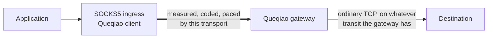

# Choosing and placing a gateway

> [!NOTE]
> **Status:** Current operational guidance for public protocol 1
> **Last reviewed:** 2026-08-28

Queqiao improves one segment of a path: the segment between a client and a
gateway, both of which the same operator controls. Every deployment decision
that matters follows from that sentence, and the one most often decided wrongly
is where the gateway should go. This document sets out how to decide it, how to
establish the facts the decision depends on, and when the correct decision is to
deploy no gateway at all.

It is written for the reader who has a destination in mind and does not yet have
a gateway. The [deployment guide](DEPLOYING.md) covers the mechanics of
installing one; what follows is the question that precedes it.

## The transport is paired

Both ends of a Queqiao session run `queqiaod`, authenticate to each other with a
provider-pinned identity and a per-device certificate, and speak protocol 1
between them. A server operated by someone else cannot take part. This is not a
gap in the current release: it is the assumption the control design rests on,
since the transport measures a segment and shares one path model across the
flows that cross it, and neither is possible without both endpoints.

The consequence is direct. A reader who wishes to improve access to a hosted
model API, a SaaS endpoint, or any other destination outside their
administrative control must first obtain a host they do control and place a
gateway on it. There is no configuration in which the far end is a third party,
and no flag that relaxes the requirement.

## The optimized segment ends at the gateway



The client and the gateway share a path model, a delay bound, an erasure
estimate, and a pacing budget. The leg from the gateway onward has none of
these. It is an ordinary connection, subject to whatever the gateway's own
transit gives it, and Queqiao neither measures nor repairs it.

From this the placement rule follows directly. **Site the gateway on the far
side of the segment that is actually degrading the traffic, and only where the
remaining leg to the destination is short and unimpaired.** A gateway that
satisfies neither condition lengthens the path. It does so silently, because
every check that can be run on the client host will still pass: the profile is
valid, the sysctls are set, the gateway answers, and the tunnel correctly
carries traffic to a place the traffic did not need to go.

Two questions therefore decide placement, and they are independent:

1. Which segment of the path is degrading the traffic?
2. Where does the session to this destination actually terminate?

The first is the question the project was built around, and its
[path characterization](PATH-CHARACTER-20260813.md) answers it at length. The
second is easier to overlook and, for a large class of modern destinations, is
the one that decides the outcome.

## Where the session actually terminates

The placement rule presumes that a destination is located where its address
suggests. For a growing class of services, it is not.

A service published behind an anycast edge announces the same address from many
points of presence at once. A client's packets reach whichever presence the
routing system considers nearest, the TCP and TLS session terminates there, and
the request then crosses the provider's own backbone to wherever the origin
runs. Two properties follow, and both bear on placement.

First, a round trip measured from the client to such a destination describes the
distance to an edge rather than to the origin. A client in Frankfurt that
measures four milliseconds to an API whose origin is understood to be in
California has not discovered a fast transatlantic path. It has discovered a
Frankfurt edge.

Second, the segment between the edge and the origin lies inside the provider's
network. Neither end of a Queqiao session sits on that segment, and no transport
the reader deploys can reach it. Whatever latency the long haul contributes is
therefore not addressable from outside, by this transport or by any other.

The consequence for placement is unwelcome, and it is worth stating as a worked
case. Consider a client in Singapore calling a model API whose origin is
understood to run in the western United States. If the API is fronted by an
anycast edge, the client's session already terminates a few milliseconds away in
Singapore. Interposing a gateway in Oregon replaces that short leg with two
longer ones: roughly seventy milliseconds from Singapore to the gateway,
followed by a further hop from the gateway out to whichever edge is nearest
Oregon. The path has been lengthened by very nearly the whole gateway leg, and
the traffic that was to be accelerated never crossed the segment the gateway was
placed to improve.

This outcome is not exotic. It is the ordinary result of applying the placement
rule to a destination whose topology was assumed rather than measured, and it is
why the first instruction below is a measurement and not a deployment.

Whether a particular API is published this way, from a particular network, on a
particular day, is not a question a document can settle. Edge footprints change,
routing changes, and a provider may serve some endpoints from an edge and others
from a region directly. Measure the destination to be called rather than
reasoning about the vendor that operates it.

## Establishing the facts before deploying

Three instruments answer three different questions, and reaching for the wrong
one produces a confident answer to a question nobody asked.

### What a local check can settle

`queqiaod doctor` establishes whether the host is in the state the published
measurements assumed and whether a gateway is placed where a given destination
can use it. Given one or more destinations, it compares reaching each of them
directly against reaching them through the local SOCKS listener, alternating the
two arms, and reports what it measured alongside what it concluded:

```sh
queqiaod doctor \
  --profile ~/.config/queqiao/*.json \
  --destination api.example.com:443 \
  --destination inference.internal:443 \
  --rounds 8
```

The report below is illustrative, not a measurement of any real service:

```
  ok    gateway_rtt              min 68.0ms p50 68.1ms p99 71.4ms (n=8), paid
                                 once per flow setup before the destination is
                                 reached
  warn  destination:api.example.com:443
                                 direct min 4.0ms p50 4.3ms p99 5.2ms (n=16);
                                 tunnel min 70.9ms p50 71.3ms p99 78.4ms
                                 (n=16); of which 68.1ms is the leg to the
                                 gateway and about 3.2ms is the gateway's own
                                 hop to the destination. The tunnel is 16.6x
                                 the direct establishment, so this destination
                                 is served closer to this client than the
                                 gateway is.

destination  api.example.com:443  (connect and TLS handshake)
  arm       n   min_ms   p50_ms   p99_ms
  direct   16      4.0      4.3      5.2
  tunnel   16     70.9     71.3     78.4
  # arm effect 67.0ms, order effect 1.2ms
  # tunnelled = 68.1ms to the gateway + 3.2ms onward (derived, not measured)
```

Three features of that report deserve comment, since they determine how much
weight it can carry.

The **decomposition** subtracts the measured gateway round trip from the
tunnelled establishment and attributes the remainder to the gateway's own hop
onward. It is a derivation rather than a measurement, and it is labelled as one.
Its value is that it separates a finding the operator can act on from one they
cannot: a large gateway leg is a placement decision that can be revisited, while
a large remainder is the gateway's own transit, which relocating the client will
not change.

The **order effect** is the noise floor of the comparison. Both arms run in both
orders within every round, and the difference attributable to position is
reported beside the difference attributable to the arm. The project has already
paid for this lesson once: on the characterized path, position in the test
sequence was worth 158ms where the policy under test was worth 2.4ms, and
running the baseline first produced a 53% win that reversed when the order was
reversed. Where the order effect equals or exceeds the arm effect, the check
declines to draw a conclusion and says so, which is the correct response to a
comparison that has not resolved the thing it was measuring.

Name **resolution differs between the arms by design**. The direct arm resolves
the destination locally; the tunnelled arm resolves it at the gateway. An
anycast name resolves to whatever is near whoever asked, so the same name looked
up in two places can name two machines on two continents. Resolving once and
dialling both arms at a single address would conceal precisely the case the
check exists to find.

What the check does not do is characterize the path. It samples connection
establishment, which is the part of the problem placement determines and the
part a local instrument can hold still. Throughput, loss, and completion time
under load are not establishment, and they belong to the instruments below.

### What only the path can settle

`pathprobe` sends open-loop at a rate nothing is permitted to adjust and counts
what arrives, which describes the path rather than a stack's response to it. Two
figures decide whether this transport applies at all.

- **Loss that does not vary with offered rate.** Sweep the rate and watch the
  delivered fraction. A flat loss percentage as the rate climbs is erasure,
  which this transport repairs. Loss that appears only near a knee is
  congestion, to which backing off is the correct response and this transport is
  not.
- **A knee well above the traffic to be offered.** Where offered traffic
  approaches the path's capacity, the bottleneck is the path itself, and the
  access-link profile's aggregate coordination is what the deployment wants.

Measure both directions. They are frequently unalike: the characterized path
dropped nothing in one direction and about fourteen percent in the other,
minutes apart. Re-measure whenever anything is compared, because that path's
loss moved between roughly zero and seventeen percent within minutes and the
transport's advantage scales with how much of it there is.

[Reproducing the datacenter measurements](MEASURING-A-DC-PATH.md) gives the
commands and the analysis in full.

### What only the workload can settle

`pathmeasure -mode workload` measures the request the deployment actually makes,
against the endpoint it actually calls, splitting each call into connect,
request-to-first-byte, and download. The split matters: a call that spends
seconds inside a model shows a small end-to-end ratio while the bytes move
several times faster, and a headline ratio conceals which of the two happened.

```sh
pathmeasure -mode workload -rounds 20 \
  -url https://inference.example.net/v1/audio/transcriptions \
  -a direct -b socks5=127.0.0.1:12080 \
  -post-file sample.wav -form-field file
```

Run the direct arm tuned. A comparison against an untuned client measures the
configuration line described below, not the transport.

## The client-side fixes that come first

On a path direction that does not erase, a fully tuned direct client reaches the
same median as this transport. Re-measured on the characterized path with one
fixed 355KB file, a warm and tuned direct client completed a real inference
upload at 240.9ms against 236.5ms through the tunnel, and both figures sit
within ten milliseconds of the floor that a 197ms round trip and a 30ms model
impose. Where that is the situation, the tunnel is an expensive way to obtain a
result a configuration change has already obtained.

Three fixes account for most of it, and the third requires care.

**Reuse connections.** A new connection pays a handshake and then climbs out of
a ten-segment initial window. On the characterized path this was the difference
between 1185.3ms and 240.9ms on the same upload.

**Set the receiving side's HTTP/2 windows.** A default receive window can bound
a transfer well below what the path carries, and no transport beneath it can
lift that bound.

**Consider `net.ipv4.tcp_slow_start_after_idle=0`, and only for the direction
the traffic sends into.** Linux defaults this to 1, which discards the
congestion window after any idle gap longer than a retransmission timeout, so a
connection held open across a pause is open without being warm. On a clean
direction the effect is large and favorable: a 300KB burst on an idle connection
went from 941ms to 209ms, and a real speech upload from 790ms to 241ms.

On a direction that erases, the same setting is harmful, and the project
discovered this by accident rather than by reasoning. Measured minutes apart on
a synthesis download over a direction erasing about fourteen percent, a 100KB
response took 827.7ms on a new connection and 2281.2ms on a warm one with the
sysctl set; a second session put the same pair at 945.2ms and 6341.1ms. Mathis
accounts for the direction of the effect. At fourteen percent erasure and a
200ms round trip the predicted steady-state rate is 0.155 Mbit/s, and a cold
flow beats its own steady state only because slow start is still ramping when
the transfer ends. Restoring the window between requests starts the flow where
cubic's sawtooth actually lives, with more in flight for a multiplicative
decrease to remove.

Set it where the traffic uploads into a clean direction, which is the common
case for inference requests. Do not assume it helps the responses coming back.

## When a gateway is nevertheless warranted

The fixes above are free, and they are bounded. Four situations lie outside what
they reach, and each is a reason to deploy.

**A direction that erases.** Independent loss is not congestion, and no
client-side setting repairs it, because the setting governs what happens after
an idle gap while erasure happens during the transfer. On the characterized
path's erasing direction, the download leg ran at 827.7ms direct against 53.4ms
through the transport in one session, and the same comparison gave 13.9x in the
session before. This is the case the transport exists for.

**Connections that are genuinely cold.** Queqiao holds a warm pooled tunnel, so
an application's connection terminates on loopback and the round trip has
already been paid. Measured through a capture agent with an unmodified
application, the connect leg fell from 187.3ms to 0.2ms and a 300KB cold request
from 1089.3ms to 624.9ms. Anything that dials per request, has been idle past a
retransmission timeout, or sits behind a load balancer that does not pool falls
in this case.

**A caller that cannot be reconfigured.** Connection reuse and the sysctl are
both client-side changes. Where the client is a vendor's SDK, a customer's code,
or a binary without source, neither is available, and the transport is the only
remaining place to intervene.

**A figure quoted at the tail rather than at the median.** The two arms converge
at the median on a clean direction and diverge sharply when the path misbehaves.
In a minute during which the path was dropping about twenty percent of pings,
the same comparison put a direct client at 916.7ms at p99 against 246.4ms
through the transport. A congestion window restored after an idle gap does
nothing about a packet that was dropped.

## Reasons unrelated to latency

Three further reasons are legitimate, and each is decided without reference to
any of the measurements above.

A gateway provides a **fixed egress address**, which is what an allowlist on the
destination requires and what a client on a residential or mobile network cannot
otherwise supply. It fixes the **jurisdiction traffic egresses from**, which may
be a compliance requirement rather than a performance one. And where a
destination is not reachable from the client's network at all, the tunnel is not
an optimization but the only path, in which case a latency comparison against an
arm that never completes is not the relevant question. `queqiaod doctor` reports
that case as such rather than as a placement result.

## Selecting a path profile

The profile is chosen from where the bottleneck is, not from where the machines
are, and it must match on both ends: the two ends classify flows independently,
so setting it on one side leaves the other demoting flows the first decided to
protect.

| Situation | Profile |
| --- | --- |
| The degraded segment is the client's own access network | `wan-shared-bottleneck`, the default and the supported one |
| A long hop between two regions one operator runs, carrying request-shaped inference traffic | `dc-long-haul`, experimental |

`dc-long-haul` is qualified on exactly one path. Everything known about it comes
from a Guiyang-to-Irvine link, so its constants are that link's constants until
a second path either confirms them or does not. Read
[the datacenter profile](DEPLOYING-DC-PROFILE.md) and its
[design rationale](DESIGN-DC-PROFILE.md) before deploying it.

## A worked deployment

Once the destination has been measured and a gateway is warranted, the
installation itself is two commands. On the gateway host, as root:

```sh
sudo ./deploy/install-server.sh \
  --binary ./queqiaod \
  --name "US West" \
  --endpoint gateway.example.net:443 \
  --user singapore-edge \
  --tune
```

The script prints one single-use invitation URI. It is a bearer credential and
should be delivered over an authenticated private channel. On the client, as the
account that will use the tunnel and not with `sudo`:

```sh
./deploy/install-client.sh --binary ./queqiaod --invite 'queqiao://enroll/...'
```

Applications then reach the tunnel at `127.0.0.1:12080` over SOCKS5, including
UDP ASSOCIATE. Verify the placement decision against the running deployment
before relying on it:

```sh
queqiaod doctor --profile ~/.config/queqiao/*.json \
  --destination api.example.com:443 --rounds 8
```

The [deployment guide](DEPLOYING.md) is the reference for everything past this
point, including hosts the scripts do not cover, multiple providers, service
installation, upgrades, and rollback.

## The limits of this guidance

The placement rule and the anycast argument are topological, and they hold
wherever their premises do. The numbers quoted throughout are not. They were
measured on one China-to-United-States path and are design evidence rather than
a prediction for another route, carrier, or hour. The
[project status](STATUS.md) records which qualification work remains open, and
the [known limitations](KNOWN-LIMITATIONS.md) record the operational boundaries
of the current release.

Two of those limitations bear directly on the decision described here. The
controller has no brake on a policed path, which drops what it cannot pass and
holds nothing, producing loss without the delay this design uses as its
congestion signal; where the segment in question is policed, the transport will
overdrive it. And the thresholds `queqiaod doctor` applies to a placement
verdict are round numbers chosen to sit either side of a topological
distinction, not constants derived from a measurement campaign. They are
intended to prompt an investigation, not to conclude one.
