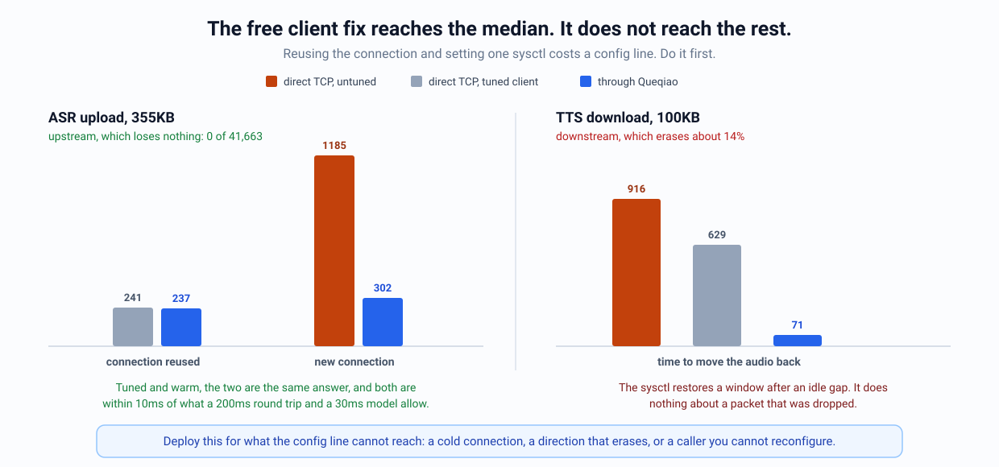

# Deploying the datacenter profile

> [!NOTE]
> **Status:** Experimental. Qualified on one path.
>
> [DESIGN-DC-PROFILE.md](DESIGN-DC-PROFILE.md) is why this profile exists, what
> separates it from the default one, the five workload shapes it carries, and
> the assumptions measurement overturned.
> [PATH-CHARACTER-DC-20260826.md](PATH-CHARACTER-DC-20260826.md) is the evidence
> behind every number here. This document is how to run it.

## Before you turn anything on

Measure the path. The profile is chosen from where the bottleneck is, not from
where the machines are, and that's a property you can check in ten minutes with
[MEASURING-A-DC-PATH.md](MEASURING-A-DC-PATH.md).

Two figures decide it:

- **Loss that doesn't change with offered rate.** Sweep with `pathprobe` and
  look for a flat loss percentage as the rate climbs. That's erasure, and it's
  what this transport repairs. Loss that only appears near a knee is
  congestion, and backing off is the right answer to that.
- **A knee well above what you'll offer.** If your traffic approaches the
  path's capacity, the bottleneck is the path and the access-link profile's
  coordination is what you want.

`queqiaod doctor` checks the part of this a machine can check:

```sh
queqiaod doctor --path-profile dc-long-haul --profile ~/.config/queqiao/*.json
```

It reports the profile's qualification level and precondition, the kernel
settings the measurements assumed, and whether the gateway answers. It does not
tell you what the path does, because no local check can: that is what
`pathprobe` is for, and the two figures below are the ones to get from it.

Then do the free things first, because they're worth more than anything below
and they cost a config line: reuse connections, set the receiver's HTTP/2
windows, and set `net.ipv4.tcp_slow_start_after_idle=0`. On the path we
characterized that last one alone took a 300KB burst on an idle connection from
941ms to 209ms.

We mean this literally, and there's a measurement behind it. Running real ASR
from Guiyang against a model in Irvine, a 355KB upload takes 1133.5ms on a new
connection and this profile takes it to 290.2ms. Reuse the connection and set
that sysctl on the client, and direct TCP reaches 225.8ms at the median, which
beats the tunnel. What it does not reach is the tail: p99 is 1026.5ms direct
against 373.5ms through the transport, because the sysctl does nothing about a
path that drops packets for reasons unrelated to congestion.

<p align="center">
  
</p>

So the question to ask before deploying anything is which of those you have.
If you control the client and your latency budget is a median, tune the client
and stop. Deploy this when you can't reconfigure the caller, when connections
are genuinely cold, or when the number you're held to is a p99. The full set of
numbers is in [PATH-CHARACTER-DC-20260826.md](PATH-CHARACTER-DC-20260826.md).

## Gateway

```sh
queqiaod provider init -state /var/lib/queqiao -name "Inference" \
  -endpoint gateway.example.net:443
queqiaod provider add-user -state /var/lib/queqiao -name edge-fra
queqiaod server --state /var/lib/queqiao --listen :443 \
  --path-profile dc-long-haul
```

The profile has to match on both ends. The two classify independently, so
setting it on one side leaves the other demoting flows the first decided to
protect.

## Client

```sh
queqiaod provider invite -state /var/lib/queqiao -user edge-fra   # on the gateway
queqiaod enroll 'queqiao://enroll/...' --local-address if:eth0    # on the client
queqiaod client --profile ~/.config/queqiao/*.json \
  --path-profile dc-long-haul
```

Applications reach it at `127.0.0.1:12080` over SOCKS5.

That is the foreground form. To install it as a service, pass the same profile
to the installer, which threads it into the LaunchAgent or systemd user unit:

```sh
deploy/install-client.sh --path-profile dc-long-haul --local-address if:eth0
```

An unknown name fails the install. It is not defaulted, because a service that
came up carrying policy the operator did not ask for is the failure the profile
package exists to prevent, and finding out at first start means the installer
has already reported success.

## Point voice at UDP, not TCP

This matters more than any tuning below it. On the path we measured, frames
carried over UDP lost a fifth of what they lost sent directly and kept the p99
within five percent of the median. The same frames over TCP lost nothing and
arrived with a p99 three and a half times the median, because reliability turns
every gap into delay for the frames queued behind it.

Use SOCKS5 UDP ASSOCIATE, which the client has always supported. If your voice
stack speaks RTP over UDP, it already does the right thing.

Requests are the opposite: a few hundred kilobytes wants the reliable path, and
gets 5 to 10 times faster completion from the pre-warmed connection pool alone.

## Telling the transport what a flow is, before it carries anything

Optional, and worth it when your workloads differ. The classifier needs about a
second to decide, and a request that finishes in 200ms is gone before then.

Run a capture agent that reports what opened each flow.
[`tunless`](https://github.com/bojieli/tunless) does this,
and point the client at its socket:

```sh
queqiaod client --profile ~/.config/queqiao/*.json \
  --path-profile dc-long-haul \
  --flow-metadata-socket /run/tunless/metadata.sock \
  --class-hint 'path=/app/checkpoint-sync=bulk' \
  --class-hint 'path=/app/=interactive'
```

First match wins. Match on the executable path unless you have a reason not to:
a pod UID is a fact about a flow, not a name anyone chose.

If the agent isn't running, isn't reachable, or doesn't recognise a flow,
everything behaves as it would without the flag. We verified that on the live
path: with a socket configured that didn't exist, requests and frames both ran
normally and the client logged nothing.

## Capturing traffic from applications you can't reconfigure

Everything above assumes the application points at `127.0.0.1:12080`. When it
can't, a capture agent puts it there without the application knowing.

```
app -> capture -> SOCKS5 -> queqiao client -> WAN -> gateway -> destination
```

[`tunless`](https://github.com/bojieli/tunless) does the capture. Its
socket-layer backend needs cgroup v2, CAP_BPF and a 5.7 kernel and is
fail-open; its `--backend redirect` needs only netfilter and is not. Pick the
first where you can.

Measured on the China-US path with an unmodified application: 300KB cold in
624.9ms through the whole stack against 1089.3ms direct, and 381.2ms once warm.
The connect leg is 0.2ms rather than 187.3ms, because the application's
connection terminates on loopback and the round trip was already paid by a
tunnel that stayed warm.

That is also where flow attribution comes from, if you want class hints: the
same agent that captured the connection knows what opened it.

## Relay layout

One shared relay per node, or several independent ones? On our path three
independent relays moved about 2.5 times the aggregate of one shared relay,
because three tunnels are three congestion controllers probing a wide path at
once. The shared relay delivered every flow within 2ms of every other, while
the independent groups spread out by 3.5 times.

Share if you care about fairness across tenants. Split if you care about total
throughput. This is the opposite of the right answer on an access link, where
the bottleneck is the client's own uplink and you can't split a share that
doesn't exist.

## What to watch

| Signal | Where | What it means |
|---|---|---|
| `queqiao_class_transitions_2_total` | metrics | flows demoted to bulk. On this profile a request shouldn't be |
| `queqiao_erasure_residual_ratio_receive` | metrics | erasure left after repair. Should be at or near zero |
| `queqiao_coded_symbols_recovered_total` | metrics | the code doing its job |
| `nonapp`, `maxbw` | `QUEQIAO_LANE_TRACE=1` | per-lane. The metrics endpoint reports the idle control connection, so use the trace when asking about the data lane |

Re-measure the path's loss whenever you compare anything. On the characterized
path it moved between roughly zero and seventeen percent within minutes, and
this transport's advantage scales with it.

To check whether it's helping your own traffic rather than a transfer of the
same size, point `pathmeasure -mode workload` at the endpoint you actually
call, with `-a direct -b socks5=127.0.0.1:1080`. It alternates the arms every
round, pairs each round against itself, and splits the request into connect,
request-to-first-byte, and download, which matters because a call that spends
seconds in a model will show a small end-to-end ratio while the bytes move
several times faster. Run it against a tuned direct client, not an untuned one,
or you will measure the sysctl you haven't set yet.

```sh
pathmeasure -mode workload -rounds 20 \
  -url https://inference.internal/v1/audio/transcriptions \
  -a direct -b socks5=127.0.0.1:1080 \
  -post-file sample.wav -form-field file
```

## The five shapes, and what to check for each

This profile carries more than requests, and the thresholds were all chosen
from the request case. Each shape has a different thing worth watching.

| Shape | Watch | Wrong looks like |
|---|---|---|
| Short request | `queqiao_class_transitions_total{class="2"}` | anything above zero: a request was demoted to bulk |
| Long-lived, intermittent | the same counter | the same. A session of exchanges must never add up to a transfer |
| Token stream | `queqiao_erasure_residual_ratio{direction="receive"}` | above a fraction of a percent. Each unrepaired symbol is a reader watching a sentence stop |
| Bulk transfer | `queqiao_class_transitions_total{class="2"}` | staying zero during a large sustained pull. That transfer is being coded and holding one lane |
| Bulk beside interactive | `queqiao_bulk_isolations_total` | staying zero while both are running |

The fourth row is the one that reads backwards from the first two, and that is
the point: the same counter means the profile is working in one case and broken
in another, so the counter alone is not the check. What the check is, is whether
the class matches the shape you know you are running.

To measure a token stream rather than infer it, `pathmeasure -mode stream`
reports how far behind the generator's own schedule each token arrived. Give it
`-stream-expect` with your generator's token interval, because the gaps between
arrivals cannot show a stall: a stall and its catch-up burst produce one long
gap and a run of zero-length ones, whose median looks healthy.

## Rolling back

`--path-profile` defaults to `wan-shared-bottleneck`, which behaves exactly as
before any of this existed. Drop the flag on both ends and you're back.
