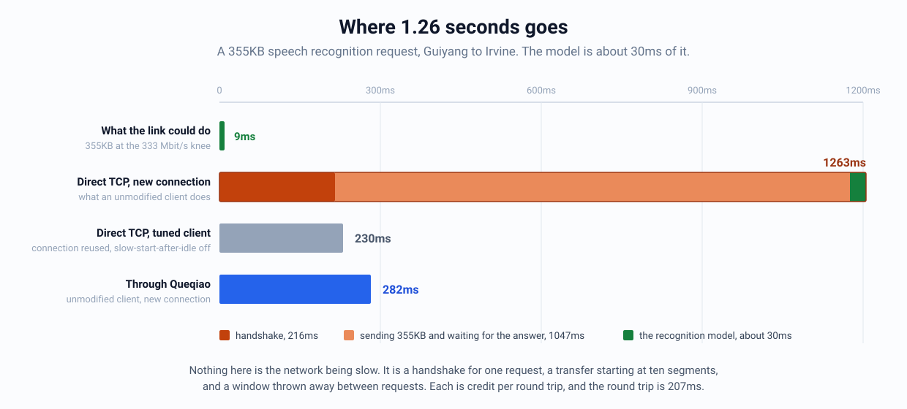
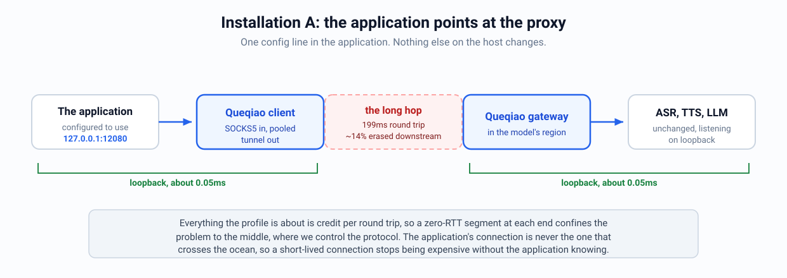
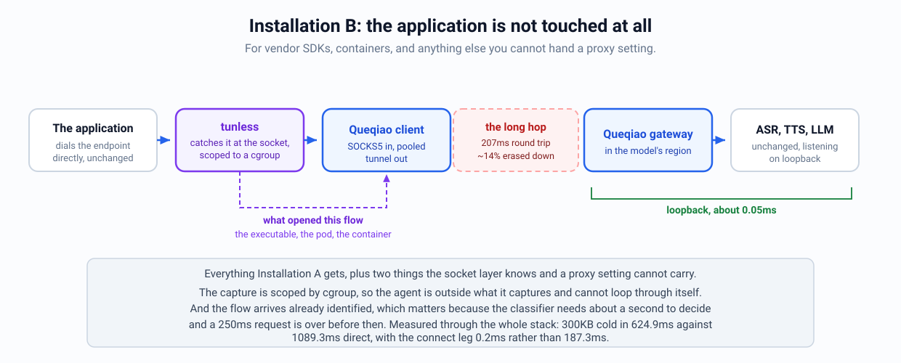

# Datacenter profile design

> [!NOTE]
> **Status:** Experimental. Tested on one path so far.
>
> **Applies to:** the `dc-long-haul` profile
> **Evidence:** [PATH-CHARACTER-DC-20260826.md](PATH-CHARACTER-DC-20260826.md)
> **Running it:** [DEPLOYING-DC-PROFILE.md](DEPLOYING-DC-PROFILE.md)
> **Last reviewed:** 2026-08-26

Queqiao's supported deployment is a client talking to a trusted gateway over a
link where that first hop is the bottleneck for everything. This profile covers
a different case: a long hop between two machines the same operator runs,
carrying requests to inference endpoints.

We need it because of how inference gets deployed. GPU serving wants big
batches and warm caches, so capacity ends up concentrated in one or two
regions. Ours have run in the US since 2023 while the clients are everywhere.
That leaves a long hop in the middle, owned by one operator, that nobody can
design away.

## Where the time actually goes

A 355KB speech request from Guiyang to a model in Irvine takes about 1.17
seconds on a new connection. The model spends about 30ms of it.

<p align="center">
  
</p>

Nothing about the path explains the rest. Its round trip is around 200ms and
its capacity knee is 333 Mbit/s, so 355KB is about 9ms of wire time. One round
trip carries the request and the answer, and with the model that is about
230ms, which is what both a tuned client and this transport actually reach.

The rest is a stack of defaults, each of which was chosen for a link that is
not this one:

- **The handshake buys nothing and costs a round trip.** 199ms of that 1169ms is
  a connection being opened for a single request.
- **The transfer starts at ten segments.** Linux opens with an initial window
  of 10 MSS, about 14.5KB, and doubles once per round trip. Reaching 355KB
  takes five of those, which on this path is a second by itself.
- **A connection held open is not warm.** `tcp_slow_start_after_idle` defaults
  to 1, so any gap longer than a retransmission timeout throws the window away
  and the next request begins at ten segments again. Six 300KB bursts on one
  connection took 941ms each, all six. Turning it off fixes that on a clean
  direction and makes an erasing one worse, which is the first sign that these
  defaults are not simply wrong: each is a reasonable answer to a question this
  path does not ask.
- **Receiver windows are sized for a LAN.** HTTP/2's default connection window
  is the 64KB the RFC specifies, which caps a stream at about 2.6 Mbit/s
  whatever the link can do. 1MB took 3903ms through a receiver at the default
  and 193ms through the same receiver with the window opened.
- **Loss here is not congestion, and TCP cannot tell.** The downstream
  direction erases about 14% of packets independently of the offered rate.
  Cubic reads that as congestion and settles at a fraction of a megabit, which
  Mathis predicts to within the measurement, while an open-loop probe pulls 256
  Mbit/s across the same channel in the same minutes.

Every one of those is a credit-per-round-trip problem, and a 200ms round trip
is what turns each into hundreds of milliseconds. That is the whole reason this
profile exists: on this path the transport is not fighting for bandwidth, it is
trying to stop a request from spending five round trips discovering capacity
that was there the whole time.

It is also why the first thing the deployment guide says is to fix the client.
Three of those five are one config line each, and on the clean direction they
reach the same median this transport does. What they do not reach is a
connection that is genuinely cold, a direction that erases, or a caller nobody
can reconfigure -- and one of the three actively hurts the erasing direction,
which is the sort of thing you only find by measuring both.

## When this profile applies

Use it when all three hold:

1. You operate both ends.
2. The hop between them is long.
3. Latency-critical requests are what the link is for, even if transfers also
   cross it.

The third one used to read "every flow is a request, not a bulk transfer,"
which contradicted the profile's own classifier: this profile does separate
bulk from interactive, at a 32MB floor rather than the access link's 128KB,
because on a datacenter leg 128KB is one ordinary request. A checkpoint pull
beside inference traffic is a shape this carries, and it is measured below.

What sends you to the access-link profile instead is not the presence of
transfers but the position of the bottleneck: if the near end of the path is
what everything is contending for, coordinating across flows is what keeps the
aggregate inside it, and that is what the other profile is built to do.

**The split is not "datacenter versus internet."** The path we characterized is
both: a cloud instance in Guiyang and a colocated server in Irvine, talking
over the public internet. It erases up to 17% and has no capacity constraint
until 333 Mbit/s, which makes it look nothing like a datacenter in the
low-latency-fabric sense and exactly like one in the sense that matters here,
which is that nothing near either endpoint is the bottleneck.

What actually separates the two profiles is **where the bottleneck is**. On an
access link it's the client's own uplink, shared by everything, and
coordinating across flows is what keeps the aggregate inside it. On this hop
there is no such constraint, so coordination buys fairness rather than
throughput, and a few hundred kilobytes is one ordinary request rather than a
transfer worth demoting.

That's a property to measure, not to infer from where the machines are. A
datacenter hop behind a saturated egress behaves like an access link, and a
residential connection to a nearby CDN behaves like this one. The hierarchical
path model exists so the answer can be discovered rather than assumed, and
`cmd/pathprobe` tells you which case you have before you choose.

Two consequences worth stating, because both were mistakes we made:

**Most fixes belong in neither profile.** The largest defect found while
building this, a long conversation losing its coding after about a minute,
affected both and was fixed globally. When a change only makes sense in one
regime, that's evidence it's a profile field; when it makes sense in both, a
profile field is the wrong place to put it.

**Carrier matters more than regime.** Voice frames over TCP have a p99 three
and a half times the median on this path, and over UDP they don't. That was
true regardless of which profile was selected, and no amount of profile tuning
would have addressed it.

## What we got wrong

We designed this profile from first principles and then went and measured it.
Five of our assumptions were wrong, and the last one was wrong twice. The
corrections are most of what follows.

**We expected the transport to hurt this workload. It helps a lot.** Cold flows
run 5-10x faster just from the pre-warmed connection pool, and the lossy
direction runs 13.5x faster with coding. Residual erasure after repair measured
zero.

**Most of that speedup isn't ours.** We compared against the TUIC-shaped
reference in `internal/baseline`, which runs on the same QUIC fork in the same
process. Getting off TCP accounts for 4.8-6.9x. Our coding adds another
1.8-2.0x on top. So the number to quote is "about twice a well-tuned QUIC
tunnel," not "fourteen times TCP."

**The tail is fine for requests and bad for frames.** Request p99 stays within
7% of the median at every concurrency we tried. Frame p99 lands 567ms above the
path's floor, with about 5% of frames arriving late. Two different problems,
and only the second one needs work.

**One relay per node isn't faster than several.** Three independent relays beat
a single shared one by roughly 2.5x on aggregate throughput, and that held with
the test order reversed. Sharing buys fairness, not speed.

**We paced flows that had produced no evidence of congestion.** Running the
real services rather than stand-ins found a transport slower than a tuned TCP
client on the median request, by 67ms out of 299ms. The cause was not a
constant that needed tuning. This transport separates loss the channel imposes
regardless of rate from loss a sender causes by pushing, and it computes both
halves continuously; the pacer was wired to neither. It metered every send at
BBR's delivery estimate, and that estimate is low for a request-shaped flow
precisely because such a flow is application-limited: one flow estimated 42
Mbit/s where sixteen estimated 88 on the same path in the same minutes.

So every request received a congestion response having produced no congestion
evidence, on a path whose own delay signal said there was no queue. The pacer
now meters only when the delay bound is reached or loss starts tracking rate.
That took the median from 299.0ms to 236.5ms, against 240.9ms for a fully tuned
direct client measured in the same minutes, and it is profile-independent: a
path that is congested produces the evidence and gets paced whichever profile
it runs.

Which is where the first version of the fix was wrong, and the way it was wrong
is worth keeping. A policer is the path where bursting is worst, and it is
invisible to both of those signals: it drops what it cannot pass and holds
nothing, so there is no queue for the delay bound, and its loss is sustained
enough that the estimator's floor rises to meet it and reports no congestive
component. `internal/pep/case4_test.go` already records that this transport
overdrives such a path. Gating on delay and congestive loss alone made it
worse, from 3.0x overdrive to 4.0x and from 32.9% loss to 54.9%, because
metering had been the last thing holding the rate down.

The burst therefore also requires the direction being sent into to be
delivering essentially everything. That is less a third signal than a refusal
to act on the absence of the first two: where loss is already high this sender
cannot separate its own contribution from the channel's, and an ambiguous
channel is one to keep metering. The two paths measured sit far apart on either
side of that line, which is the only reason a threshold is defensible: the
datacenter upload lost 0 of 41,663 datagrams, and the emulated policer loses a
third of everything.

## The five shapes this profile carries

The profile was designed from one workload, a request of a few hundred
kilobytes, and every threshold in it was chosen from that case. A threshold
chosen from one shape is untested against the others, and this transport
carries at least five.

| Shape | What it looks like | Where it must land |
|---|---|---|
| Short request | one burst up, a small answer back, connection may be new | not bulk; coded |
| Long-lived, intermittent | the same, on a connection held open across pauses | interactive, permanently |
| Token stream | a short prompt up, then tens of bytes back every 30ms for as long as the answer takes | interactive, coded, and protected against a single loss |
| Bulk transfer | tens of megabytes, sustained | bulk; retransmitted rather than coded |
| Bulk beside interactive | a checkpoint pull while inference traffic runs | the transfer must not cost the requests |

Two of them broke the design as written, and both breakages came from a
quantity being read as evidence of something it is not evidence of.

**A single stall decided what a flow was for the rest of its life.** The idle
veto disqualifies a flow from ever being bulk once it has been seen quiet, on
the reasoning that a flow seeking throughput does not stop asking for it. The
reasoning is right; the threshold was one observation, which is a different
claim. A 240MB pull that paused once anywhere inside its first 32MB spent every
remaining byte classified interactive, which means coded and holding one lane.
That window is the beginning of every transfer, and the beginning is where a
cold source or an authorization round trip puts a stall. It now takes two
separate gaps, because one is an event and two is a pattern. Confirmed on the
live path: a 90-second transfer moving 1.35GB reached the bulk class, where a
300MB one offered in a single 8.57s burst does not, the age floor being what
stops a five-megabyte request from being read as a transfer.

**A token stream was protected according to how fast it was going.** The code
sizes a block by maximising delivered bytes per symbol time, pricing a
retransmission in symbols the flow could have sent instead. A block that seals
short seals because the producer stopped, so those symbols were never going to
be sent: the spare capacity is free, and the objective was valuing it as
scarce. Measured at the symbol size that ships, a single symbol on a 14%
channel got no repair at all at the 20 KB/s rate estimate a token stream
demonstrates, one repair at 100 KB/s, two at 850 KB/s. The protection followed
the estimate, and an application-limited flow is exactly the one whose estimate
is low.

The token stream is the shape that punishes this hardest. Every other workload
has traffic behind it, so a loss is exposed within a round trip by the packets
that follow. A token has nothing behind it for another thirty milliseconds, so
the loss is found by timeout, and one timeout on a 200ms path is ten tokens the
reader is waiting on. Blocks of four symbols or fewer are now sized to a
delivery probability rather than to throughput.

The fifth shape turned out to be fine, and could only be shown to be fine on
the emulator. A transfer taking 78% of the bottleneck moved a token stream's
p99 lateness by 54 microseconds, with every token arriving in both arms. On the
live path the question is unanswerable: the link drifts further in ten minutes
than the effect being looked for, so the arm measured last is the worst one
whether or not it is the arm with the transfer in it.

## Design

### Profiles

`internal/profile` makes the deployment an explicit choice. Each profile
carries a precondition you can check and disprove, a pointer to the
measurements behind its constants, a release level, and whatever policy
differs. The access-link profile is the default.

An unrecognized profile name is an error. We don't fall back to the default,
because then a process would be running policy the operator didn't ask for with
nothing in the logs to show it.

### Aggregation instead of probing

A bandwidth estimate only improves from samples that were not
application-limited, and a single bursty flow rarely produces one. The
node-relay shape rests on the claim that an aggregate fed by many flows does.

Measured on the lane carrying data, read from the per-lane trace rather than
from the aggregate metrics endpoint, which reports the idle pooled control
connection:

| concurrent flows | non-app-limited samples | bandwidth estimate |
|---|---|---|
| 1 | 12 | 6.8 Mbit/s |
| 4 | 30 | 24.6 Mbit/s |
| 16 | 31 | 87.6 Mbit/s |

Thirteen times the estimate for sixteen times the flows. So we don't need a
synthetic probe, which on a policed path would drain a token bucket and report
the drain rate as the path's capacity. That failure mode is what made us ask.

### Modeling the path as a chain

`PathModel` describes one endpoint pair. That's the right model when every flow
crosses the same bad segment. It breaks down when flows go to different places.
Give each destination its own model and they all have to relearn the shared
uplink separately. Give them one model and a congested peer slows down traffic
to a healthy one.

`internal/pathmodel/tree.go` chains the existing node type: uplink, then group,
then peer. A chain of one behaves exactly like today's single model, so nothing
existing changes. How we combine the nodes depends on the field, because using
one rule everywhere would make the tree worse than no tree:

- **Share and Seed take the minimum.** A flow can't exceed the tightest segment
  it crosses.
- **Erasure, burst factor, and RTT take the maximum.** Loss accumulates along
  the path, and a leaf crosses everything its parents do. Taking the smaller
  value would size the code for part of the channel.
- **A node with fewer than 100 samples doesn't constrain anything.** That's the
  same sample count the prewarm sends, for the same statistical reason. Without
  it, the first flow to a new destination gets throttled by a node that hasn't
  measured anything yet.

We decide which segments are actually shared by measuring, not by assuming.
`internal/pathmodel/correlate.go` buckets each group's loss and RTT inflation
into 200ms windows and correlates the first differences. If you correlate raw
levels instead, you find that every pair of paths gets worse in the evening,
and the tree collapses to a single root for a reason that has nothing to do
with a shared queue. Differencing cancels the common trend.

`SuggestMerges` reports what correlates and `MergeGroups` acts on it. Ordinary
reporting feeds the correlator, and the datacenter profile applies suggestions
at a bounded cadence; the access-link profile gathers nothing and rearranges
nothing.

We merge but don't automatically split. That sounds asymmetric and isn't: once
two groups share a node they share a budget, and the shared budget is exactly
what smooths away the congestion signal that would tell them apart again.
Undoing a merge is `SplitGroup` and an operator with a reason. The threshold is
0.8 on differenced short-window signals, which is deliberately higher than the
bar for leaving them apart.

### Flow classification

On an access link, 128KB is a sensible point to start suspecting a flow will
starve an interactive one. On a datacenter hop it's one ordinary request. Bulk
traffic here means a checkpoint pull: tens of megabytes, sustained. The
thresholds say so.

Thresholds alone aren't enough, since a long-lived connection eventually
accumulates enough bytes to trip them. Neither byte count nor rate separates
the two cases, because a request burst is briefly *faster* than the bulk rate
floor, not slower. What separates them is duty cycle. A flow we've seen go idle
can't be reclassified as bulk afterward.

Worth being clear: this change is well-reasoned but we haven't shown it helps.
It does stop the demotion (`class_transitions_2_total` drops from 1-4 to 0),
and it moves latency by 2.4ms on a 455ms baseline, which is noise. That's why
it sits behind an experimental profile.

### Knowing what a flow is before it carries anything

The classifier needs about a second of traffic to decide. A request that
finishes in 200ms spends its whole life inside that second, so it is carried in
whatever class it started in. Shortening the window doesn't help; removing it
does.

`tunless` captures at the socket layer, so it knows the calling process and,
on a host running containers, the pod or container it belongs to. That's
available before the first byte moves. Point the client at the agent's socket:

```sh
queqiaod client --profile ... --path-profile dc-long-haul \
  --flow-metadata-socket /run/tunless/metadata.sock
```

The mapping from what the agent reports to a class is repeatable on the
command line:

```sh
queqiaod client --profile ... --path-profile dc-long-haul \
  --flow-metadata-socket /run/tunless/metadata.sock \
  --class-hint 'path=/app/checkpoint-sync=bulk' \
  --class-hint 'path=/app/=interactive'
```

First match wins, so put specific rules before general ones. The separator is
the last `=`, because the match itself usually contains one.

Two things fail at startup rather than at runtime: a misspelled class name,
which would otherwise look identical to a rule whose workload never appeared,
and a hint given without a socket, since nothing would be there to ask.

Three things are deliberate here.

**Policy lives in Queqiao, not in tunless.** The agent reports what produced a
flow and stops there, which is what its own documentation promises. A pod UID
isn't a name anybody chose, so the useful thing to match on is usually the
executable path.

**A hint is a starting point, not a promise.** The classifier keeps judging the
flow by what it does, so a process declared interactive that turns out to be
moving a checkpoint is still demoted. Declaring bulk is sticky, because that's
the same conclusion inference would reach later.

**Everything about it is optional and bounded.** No agent, an agent that has
forgotten the flow, a process that exited, or no matching hint all leave the
flow exactly as it would have been. The lookup runs on the accept path, so it
has a short timeout: attribution is worth having and not worth waiting for.

### Frames go over UDP, where the transport already handles them

A 300KB request is about 200 packets. There's a block worth coding over, and
there's traffic behind a loss to expose it quickly. An 80-byte audio frame is a
single packet with neither, so we expected it to need something new.

It doesn't. Measured on the live path at 3.6% loss, 16 sessions of 200
messages:

| carrier | lost | p50 | p99 | p99/p50 |
|---|---|---|---|---|
| UDP, direct | 163 of 3200 | 193.6ms | 213.7ms | 1.10 |
| UDP, through Queqiao | 34 of 3200 | 208.2ms | 217.6ms | 1.05 |
| TCP, through Queqiao | 0 | 208.4ms | 728.4ms | 3.49 |

Over UDP the transport removes four fifths of the lost frames and the tail
stays flat. Over TCP nothing is lost and the tail is three and a half times the
median, because reliability turns every gap into delay for the frames behind
it.

So the answer is UDP ASSOCIATE, which has been here since the beginning. Our
earlier reading of this as an open problem came from measuring voice over TCP,
which is not how voice travels. Point a voice application at the UDP path and
it gets both properties at once.

The transport's own counters show the mechanism. Over a 52-second session on
an emulated 14% path the coded substrate carried 2270 symbols, recovered 1708,
and lost 5. Five failures can't make one percent of frames slow by themselves.
They do it by stalling what's queued behind them, which is a property of the
carrier.

One real defect turned up while chasing this. Whether a flow counted as a
series of small exchanges was decided from its lifetime byte total, so a voice
call crossed the budget after about a minute and was demoted to bulk, losing
its coding for the rest of the call. It's now a rate over a recent window: a
transfer never drops under it, and a conversation never reaches it whatever its
age.

### L7 ingress, for receivers you don't control

If you can raise the receiver's HTTP/2 window, do that. It's worth 20x when the
window is actually RFC 7540's 65535. Check first, though: Go's `x/net/http2`
defaults both upload buffers to 1MB, and gRPC-go sizes its window from a
measured BDP, so most Go services are already fine.

When you can't change the receiver, put an ingress next to it. It terminates
HTTP/2 with large windows and streams the body onward. A window is credit per
round trip, so a short hop makes even a small window irrelevant. We measured
1MB going from 3394.9ms to 190.8ms with the far end untouched.

Three things have to hold or the extra hop costs more than it saves, and all
three come from how it's written rather than from tuning. The body streams
instead of buffering. Backpressure propagates, because the copy only reads as
fast as the far side accepts. Cancellation propagates, because the outbound
request inherits the inbound request's context.

Terminating HTTP/2 also means inheriting its attack surface: HPACK
decompression bombs, CONTINUATION floods, reset storms. Keep this on the
specific case that needs it. Don't make it the default shape.

## Deployment

There are two ways to put an application behind this, and which one you can use
depends on whether you can hand it a proxy setting.

<p align="center">
  
</p>

<p align="center">
  
</p>

Applications connect over loopback, where the round trip is about 0.05ms and
none of the problems above apply. Everything discussed here is credit per round
trip, so putting a zero-RTT segment on each end confines the problem to the
middle, where we control the protocol. Short-lived connections stop being
expensive without touching the application.

**Choosing a relay layout is a fairness decision, not a throughput one.**
Several independent relays move about 2.5x the aggregate of one shared relay,
because three tunnels mean three congestion controllers probing a wide path at
once. But the shared relay delivered all 24 flows within 2ms of each other,
while the independent groups spread out by 3.5x. Share if you care about
fairness across tenants. Split if you care about total throughput.

This is the opposite of what we found on the access link, where we measured
multipath and dropped it after four lanes came in slower than one. Both results
are right, for different paths. You can't split a share that doesn't exist.

## How we measure

This path's loss rate swings between roughly zero and 17% over a few minutes,
and the transport's advantage tracks it: 13.5x at 14% loss, 6.5x in the single
digits. So:

- **Take a loss measurement alongside every comparison**, in the same minutes.
- **Alternate the order and pool the results.** Position in the test sequence
  was worth 158ms here, while one policy we were testing was worth 2.4ms.
  Running the baseline first showed a 53% win that flipped when we reversed the
  order. `pathmeasure -mode ab` alternates and pools automatically, and warns
  when the order effect is larger than the effect you're testing.
- **Include the QUIC arm.** Comparing only against TCP overstates our
  contribution by about 7x.

## Not done yet

- Splitting a merged group back apart is manual, for the reason above.
- One path. This profile stays experimental until we've run it on more.
- `--cgroup kubernetes` is built and unit-tested against both cgroup drivers,
  but has never run against a real cluster.
- Sockmap splicing would cut the per-byte cost. We haven't built it because no
  relay we've measured is CPU-bound, and it would be the wrong thing to
  optimize first. That is now closer than it was: a client sustaining 310
  Mbit/s spent 75% of one core doing it, so the ceiling on that host is CPU
  rather than the path. A client is not a relay, so this does not settle it,
  but the condition named for reconsidering has stopped being hypothetical.
- The short-block sizing fix is proven where it can be and not where it
  matters most. At the sizing level it is deterministic and the tests fail with
  the rule disabled. End to end it is unproven, because the path changed
  character between the run that found the problem and the run that would have
  confirmed the fix: erasure fell from 14% to 4.3% and the burst factor rose to
  2.0, so loss stopped arriving independently. A channel that holds still for
  the length of a comparison is what settles it, and this path does not.
- The unmetered burst rests on a threshold, which is the thing this design
  otherwise avoids. It is defensible only because the two paths measured sit far
  apart on either side of it, and a third path landing in between would make it
  a guess. What would replace it is a congestion signal a policer cannot hide
  from, which is the open problem in
  [CONTROL-REDESIGN.md](CONTROL-REDESIGN.md) and not a new one.
- Coding is sized per block and the class is fixed per lane, which is why the
  fix keys on how a block sealed rather than on what kind of flow produced it.
  A lane carries every class at once, so `fec.ClassInteractive` is not reachable
  at runtime; block length is the signal that survives that. It is the right
  signal for this case and it is not obviously the right one for every case.
